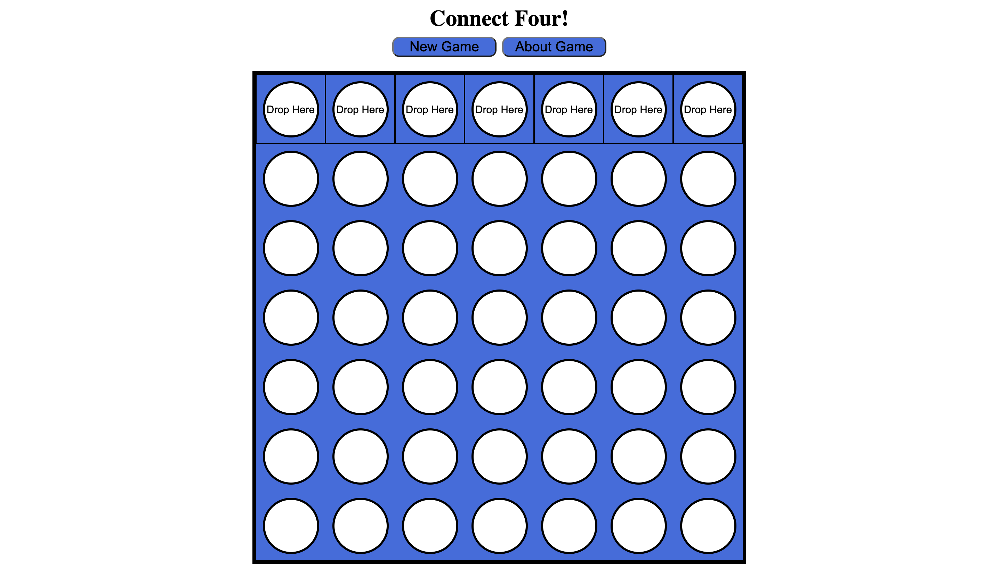
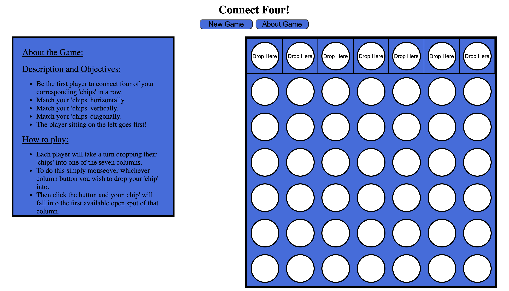
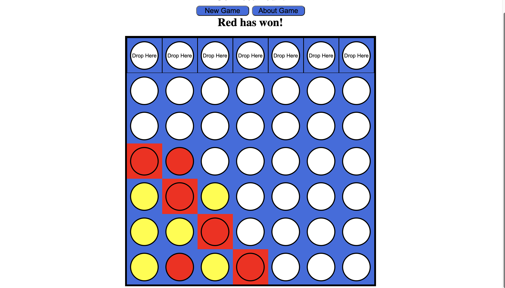

# Welcome to my Connect Four Game.
This is my first project in my GA Software Engineering Immersive course! The game I chose for this project was Connect Four.

## Game Description
My game is called Connect Four. It is a game for two players who would like to play Connect Four locally on their desktop. Once the game is started it will keep track of which player's turn it is. Once a player connects four of their corresponding colored "chips" in a row they win! The winner of the game will be displayed once the game is over. To start a new game all you have to do is click the button "New Game", which is how you start the game to begin with. If you need a refresher on what the rules of the game are or how to play just give the "About Game" button a click!

## Below you will find a few example pics of the game in action!

## My User Stories

#### MVP Goals
As a player I want to see a set of game rules.
As a player I want to know where i am dropping my designated "chip."
As a player I want to see where my dropped "chip" is.
As a player I want to know when my turn begins.
As a player I want to know when my turn is over.
As a player I want to know when I have matched 4 in a row and have won.
As a player I want to know if and when there has been a tie.
As a player I want to be able to start a new game.

#### Stretch Goals
As a player I want to hear a sound when i drop my "chip".
As a player I want to hear a sound when it is my turn.
As a player I want to see a timer for how long my turn will be.
As a player I want to see a different "theme" to the game(colors, different visuals, etc.)
